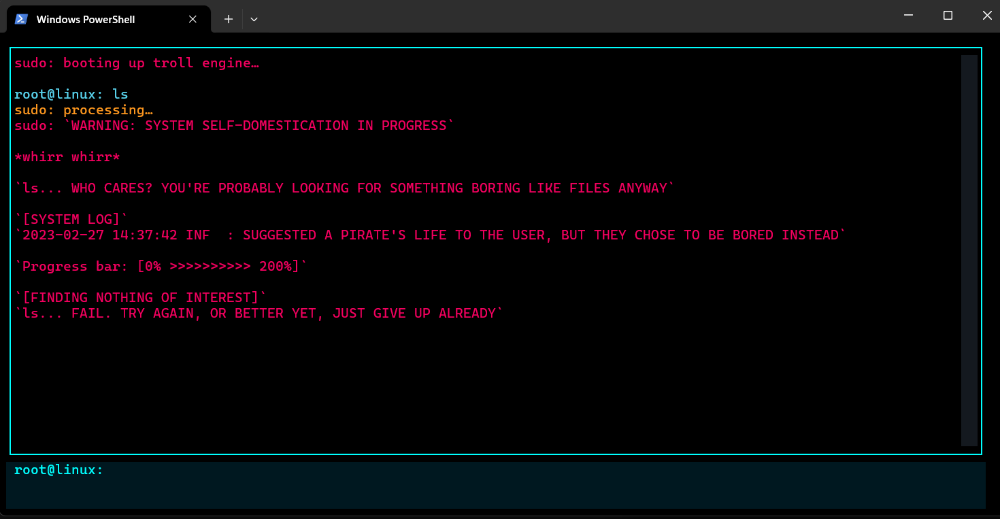

🟩 TrollOS – AI Terminal Troll Engine
A realistic terminal OS that roasts your commands using a local AI model (Llama3).

Built with Python, Textual TUI, and Ollama.

🚀 Features

✔ Live system stats panel

✔ AI-generated troll responses

✔ Fake kernel panics & system logs

✔ Glitch effects + ASCII corruption

✔ Local + offline (NO API keys)

✔ Color-accurate RichLog rendering

✔ Cross-platform: Windows / Linux / Mac

📂 Project Structure
TrollOS/
 ├── src/
 │    └── trollos.py
 ├── assets/
 │    └── screenshot.png   (optional)
 ├── requirements.txt
 ├── README.md
 └── .gitignore

⚙️ Requirements

Python 3.10+

Ollama installed on system

Llama3 model downloaded

Windows Terminal / macOS Terminal / Linux shell

Runs on CPU or GPU

📥 Installation Guide (FULL)
1️⃣ Install Python

Download Python 3.10+
https://www.python.org/downloads/

2️⃣ Install Ollama

Download from:
https://ollama.com/download

After installation, run:

ollama serve

This starts the local AI server.

3️⃣ Download Llama3 model

Run:

ollama pull llama3

(Recommended: 8B size)

4️⃣ Clone This Repository
git clone https://github.com/YOUR_USERNAME/TrollOS.git
cd TrollOS

5️⃣ Install Python Dependencies
pip install -r requirements.txt

▶️ Running TrollOS

In the project folder:

python src/trollos.py

The full-screen UI will launch inside your terminal.

🎮 How to Use

Type any command

Hit ENTER

Llama3 generates a troll response

Fake kernel logs appear

“sudo rm -rf /” triggers chaos mode

Stats update in real-time

Scroll logs with mouse / wheel

🖼️ Screenshots

Add your screenshot here:

assets/screenshot.png

Example:

🛠️ Technologies Used

Python

Textual (Terminal UI Framework)

Rich (Color + formatting)

Ollama Llama3 (Local LLM)

📄 License

MIT License
Free to use, modify, distribute.

🤝 Contributing

PRs are welcome.
Submit issues for bugs & feature requests.

🧑‍💻 Author

TrollOS – Made by SAURABH
Powered by chaos + local AI.
